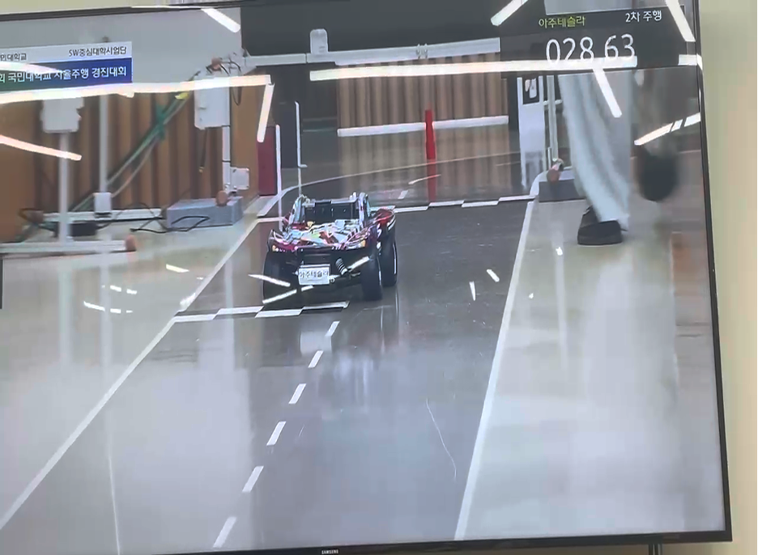
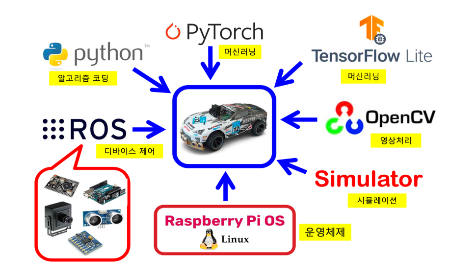
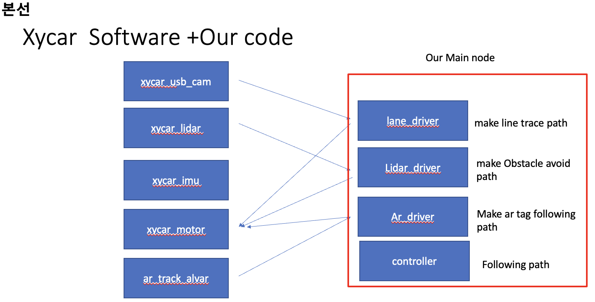

# Auto-Driving-Kmu-Compotetion-2024
for KMU compotetion

## Overview
### Architecture

The `xycar_ws` workspace is structured as follows:

```
xycar_ws/
├── src/
│   ├── xycar/
│   │   ├── CMakeLists.txt
│   │   ├── package.xml
│   │   ├── launch/
│   │   ├── src/
│   │   ├── include/
│   │   └── msg/
│   └── other_packages/
├── build/
├── devel/
└── logs/
```

## What I did

### lane driver

### lidar driver